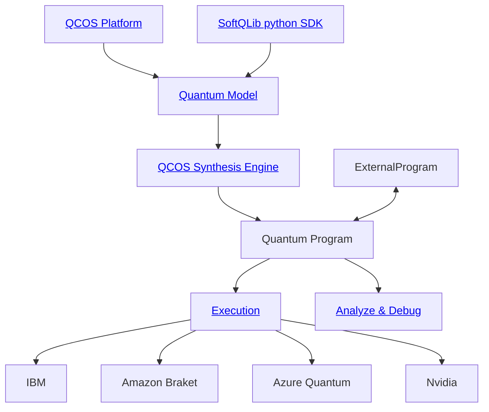

[](https://opensource.org/license/mit)
[](https://badge.fury.io/py/softqlib)

[](https://pepy.tech/project/softqlib)

<div align="center">
    
</div>

# The Softquantus Library

**The largest collection of quantum algorithms and applications — open source for the community.**

Powered by [QCOS](https://github.com/softquantus/qcos) — Softquantus Quantum Computing Operating System.

Whether you're a researcher, developer, or student, the Softquantus Library is the best way to explore quantum computing software. This repository hosts a comprehensive collection of quantum functions, algorithms, applications, and tutorials built with the [SoftQLib SDK](https://pypi.org/project/softqlib/) and our native Qmod language.

We welcome community contributions to our Library!

<hr> <br>

<p align="center">
   &emsp;
   <a href="https://platform.softquantus.com/">⚛️ Platform</a>
   &emsp;|&emsp;
   <a href="https://github.com/softquantus/softquantus-library/discussions">💬 Community</a>
   &emsp;|&emsp;
   <a href="https://docs.softquantus.com/latest/">📖 Documentation</a>
   &emsp; | &emsp;
   <a href="https://docs.softquantus.com/latest/softqlib_101/">Getting Started</a>
   &emsp;
</p>

<hr>

[](https://github.com/softquantus/softquantus-library/graphs/contributors)

The Softquantus Library enjoys the support of more than 100 contributors!

Feel free to join and submit your own fantastic quantum algorithm!

[](https://github.com/softquantus/softquantus-library)

<hr>

# Installation

[](https://pypi.org/project/softqlib)

The SoftQLib SDK is the Python interface to QCOS:

```bash
pip install softqlib
```

Alternatively, after cloning this repository, you may run

```bash
pip install --upgrade -r requirements.txt
```

## Running This Repository's Demos

This repository has 2 kinds of demos: `.qmod` and `.ipynb`.

The `.qmod` files contain quantum programs in Qmod language, ready to be synthesized and executed on QCOS. Upload them to the [Synthesis tab](https://platform.softquantus.com/synthesis) on our platform.

The `.ipynb` files are Jupyter Notebooks — view them in [JupyterLab](https://jupyter.org/) or VS Code.

## Use the library with AI agents

See the [SoftQLib documentation](https://docs.softquantus.com/latest/user-guide/ai/) to learn how to use the library with AI agents.

# Create Quantum Programs

The simplest quantum circuit has 1 qubit and a single `X` gate. Using the SoftQLib SDK:

```python
from softqlib import *

NUM_QUBITS = 1


@qfunc
def main(res: Output[QBit]):
    allocate(NUM_QUBITS, res)
    X(res)


quantum_program = synthesize(main)

show(quantum_program)

result = execute(quantum_program).result_value()
print(result.dataframe)
```

|     | res | count | probability | bitstring |
| --: | --: | ----: | ----------: | --------: |
|   0 |   1 |  2048 |           1 |         1 |

Let's unravel the code above:

1. `def main` : We define the logic of our quantum program. We'll expand on this point soon below.
2. `synthesize` : We synthesize the logic we defined into a Quantum Program. From a logical definition of quantum operations, into a series of quantum gates.
3. `execute` : Executing the quantum program. Can be executed on a physical quantum computer, or on simulations. Defaults to simulations.

## 1) Defining the Logic of Quantum Programs

The function above had 4 lines:

```python
@qfunc
def main(res: Output[QBit]):
    allocate(NUM_QUBITS, res)
    X(res)
```

The 1st line states that the function will be a quantum one. [Further documentation](https://docs.softquantus.com/latest/qmod-reference/language-reference/functions/).

The 2nd line defines the type of the output. [Further examples on types](https://docs.softquantus.com/latest/qmod-reference/language-reference/classical-types/)

The 3rd line allocates several qubits (in this example, only 1) in this quantum variable. [Further details on allocate](https://docs.softquantus.com/latest/qmod-reference/language-reference/quantum-variables/)

The 4th line applies an `X` operator on the quantum variable. [Further details on quantum operators](https://docs.softquantus.com/latest/qmod-reference/language-reference/operators/)

### More Examples

Initializing $\ket{-}$ state:

```python
@qfunc
def prep_minus(out: Output[QBit]) -> None:
    allocate(1, out)
    X(out)
    H(out)
```

A part of the Deutsch Jozsa algorithm (see the full algorithm [here](/algorithms/foundational/deutsch_jozsa/deutsch_jozsa.ipynb))

```python
@qfunc
def deutsch_jozsa(predicate: QCallable[QNum, QBit], x: QNum) -> None:
    hadamard_transform(x)
    my_oracle(predicate=lambda x, y: predicate(x, y), target=x)
    hadamard_transform(x)
```

A part of a QML encoder (see the full algorithm [here](/algorithms/QML/quantum_autoencoder/quantum_autoencoder.ipynb))

```python
@qfunc
def angle_encoding(exe_params: CArray[CReal], qbv: Output[QArray[QBit]]) -> None:
    allocate(exe_params.len, qbv)
    repeat(
        count=exe_params.len,
        iteration=lambda index: RY(pi * exe_params[index], qbv[index]),
    )
```

For more, see this repository :)

## 2) Synthesis : Logic to Quantum Program

This is where the magic happens. Taking a the `main` function, which is a set of logical operations, and synthesizing it into physical qubits and the gates entangling them, is not an easy task.

QCOS synthesis engine is able to optimize this process, whether by requiring the minimal amount of physical qubits, thus reusing as many qubits as possible, or by requiring minimal circuit width, thus lowering execution time and possible errors.

## 3) Execution

QCOS provides an easy-to-use way to execute quantum programs, and provides various insights of the execution results together with a familiar interface: `pandas.DataFrame`.

## Diagrams

1 diagram is worth a thousand words



# Build Your Own

With QCOS and SoftQLib, you can build anything. SoftQLib provides a powerful modeling language to describe any quantum program, which can then be synthesized and executed on any hardware or simulator. Explore our [Documentation](https://docs.softquantus.com/latest/) to learn everything.

## SDK : Python Interface

### Example: Calculating 3+5

```python
from softqlib import *


@qfunc
def prepare_3(var: Output[QArray]) -> None:
    allocate(2, var)
    X(var[0])
    X(var[1])


@qfunc
def prepare_5(var: Output[QArray]) -> None:
    allocate(3, var)
    X(var[0])
    X(var[2])


@qfunc
def main(res: Output[QNum]) -> None:
    a = QNum("a")
    b = QNum("b")

    prepare_3(a)
    prepare_5(b)

    res |= a + b  # 3+5 should be 8
    drop(a)
    drop(b)


quantum_program = synthesize(main)

show(quantum_program)

result = execute(quantum_program).result_value()
print(result.dataframe)
```

|     | res | count | probability | bitstring |
| --: | --: | ----: | ----------: | --------: |
|   0 |   8 |  2048 |           1 |      1000 |

For some pre-built state preparations, read [here](https://docs.softquantus.com/latest/qmod-reference/api-reference/functions/open_library/state_preparation/?h=state)

## Contributing

We welcome contributions! See our [CONTRIBUTING.md](CONTRIBUTING.md) for guidelines on how to add new algorithms, applications, and functions to the library.

<hr>

Have questions? Feedback? Something to share?
Join us on [GitHub Discussions](https://github.com/softquantus/softquantus-library/discussions) and be part of the Softquantus community.
